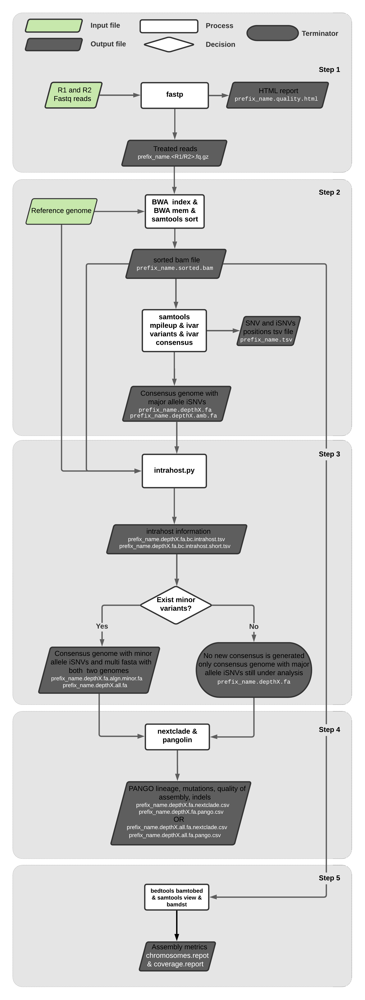

IGM_SARSCOV2 - forked from dezordi/ViralFlow
============================================

This repository contains a set of scripts to performs a reference guided genome assembly of SARS-CoV-2. Python scripts were developed based on the wuhan SARS-CoV-2 reference genome NC_045512.2. The workflow was developed to work with Illumina paired-end reads. Tests with other technologies should be performed.

=====
Dependencies
=====

* <igm_sarscov2> conda environment
    * BWA Version: 0.7.17-r1188
    * samtools 1.10 Using htslib 1.10.2
    * fastp 0.22.0
    * iVar version 1.3.1
    * bam-readcount version: 0.8
    * Python 3.6.10
    * mafft v7.487 (2021/Jul/25)
    * seqkit v2.0.0
    * seqtk 1.3-r106
    * exonerate version 2.4.0 Using glib version 2.68.0
    * pangolin 3.1.11
    * nextclade 0.14.4
* <plot> conda environment
    * numpy 1.21.2
    * pandas 1.3.3
    * pysam 0.17.0
    * seaborn 0.11.2

=====
Files info
=====

.. code-block:: text

    IGM_SARSCOV2:
     ├-ARTIC_V3.fasta        ### Fasta file that contains ARTIC V3 primers
     ├-ARTIC_V4.fasta        ### Fasta file that contains ARTIC V4 primers
     ├-FIOCRUZ-IOC_V2.fasta  ### Fasta file that contains FIOCRUZ-IOC V2 primers
     ├-INSTALL               ### Script for install dependencies
     ├-NC_045512.2.fasta     ### SARS-CoV-2 Reference Sequence
     └-bash_scripts:
      ├-folder_info          ### Script for folder and fastq.gz ID info
      ├-igm_sarscov2         ### Perform the genome assembly and stats (FIOCRUZ-IGM modifications)
      ├-pangolin_nextclade   ### Run pangolin and nextclade
      ├-sars2_assembly       ### ViralFlow script
     └-python_scripts:                       
      ├-bwa_index.py         ### Run bwa index
      ├-bwa_mem.py           ### Run bwa mem
      ├-fastp.py             ### Run fastp
      ├-get_mvs.py           ### Perform intrahost variant analysis with bam-readcount and intrahost.py
      ├-intrahost.py         ### Identify genomic positions with multi-allele frequencies
      └-ivar.py              ### Run ivar variant and ivar consensus

=====
Explained Usage
=====

.. code:: bash

    folder_info

.. code:: bash

    igm_sarscov2 <PRIMER_SCHEME>

* <PRIMER_SCHEME>   -   Fasta file with PRIMER SCHEME used in the library preparation.

.. code:: bash

    pangolin_nextclade

.. code-block:: text

    IGM_SARSCOV2:
     └-ANALYSIS:
      ├-"$i"_R1.fastq.gz
      ├-"$i"_R2.fastq.gz
      └-"$i".results:
       ├-"$i".R1.fq.gz                           ### trimmed R1 fastq file
       ├-"$i".R2.fq.gz                           ### trimmed R2 fastq file
       ├-"$i".coverage.pdf                       ### 
       ├-"$i".depth10.amb.fa                     ### consensus defined with iVar with ambiguous nucleotideos on positions where major allele frequencies correspond at least 60% of depth.
       ├-"$i".depth10.fa                         ### consensus defined with iVar
       ├-"$i".depth10.fa.algn                    ### 
       ├-"$i".depth10.fa.algn.minor.fa           ### fasta file with minor consensus genome
       ├-"$i".depth10.fa.bc                      ### bam-readcount output, with all nucleotide frequencies by genomic position
       ├-"$i".depth10.fa.bc.intrahost.short.tsv  ### short tsv file with minor variant informations
       ├-"$i".depth10.fa.bc.intrahost.tsv        ### tsv file with minor variant informations
       ├-"$i".ivar60.qual.txt                    ### 
       ├-"$i".qual.txt                           ### 
       ├-"$i".quality.html                       ### html file with quality controll informations
       ├-"$i".sorted.bam                         ### sorted bam file
       ├-"$i".sorted.bam.bai                     ### index of sorted bam file
       ├-"$i".time.txt                           ### time in minutes of each step of analysis.
       ├-"$i".tsv                                ### tsv output from iVar with the frequencies of iSNVs
       └-fastp.json                              ### 
      ├-"$library"_consensus.fa                  ### 
      ├-"$library"_coverage_depth.pdf            ### 
      ├-"$library"_folder_info.txt               ### 
      ├-"$library"_log.txt                       ### 
      ├-"$library"_stats.txt                     ### 
      ├-nextclade_all_YYYY-MM-DD.txt             ### nextclade csv output
      ├-pangolin_all_YYYY-MM-DD.txt              ### pangolin lineages information
      └-pangolin_nextclade_log_YYYY-MM-DD.txt    ### pangolin and nexclade log analysis

=====
Disclaimer
=====
* You need to run the <folder_info> and <igm_sarscov2> scripts inside the folder that contains the raw fastq files.
* The <pangolin_nextclade> script is performed inside the IGM_SARSCOV2/ANALYSIS folder.
* The minor consensus version is based only on replacing the nucleotide from the consensus (majority consensus) with the minor allele (supported by 5 to 49% of the reads), without any statistical method to reconstruct quasispecies genomic populations. For minor variants with percentage near of 50%, the results of this step should be curated mannualy owing the possibility of different frequencies from ivar and bam-readcount analysis.
* If you use this workflow for academic purposes, please cite the principal repository:
    * https://github.com/dezordi/ViralFlow;
    * ViralFlow: an automated workflow for SARS-CoV-2 genome assembly, lineage assignment, mutations and intrahost variants detection. DOI: 10.1101/2021.10.01.21264424.
